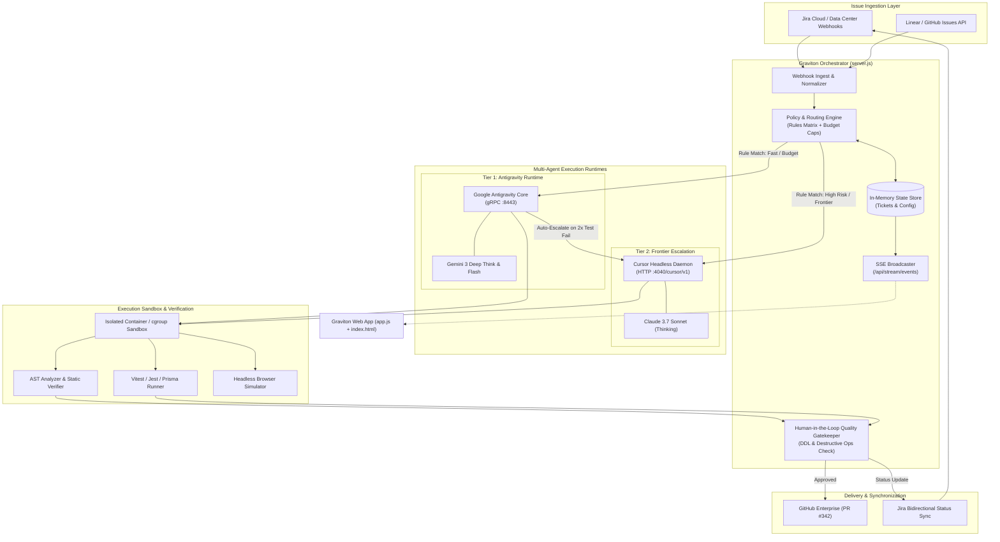
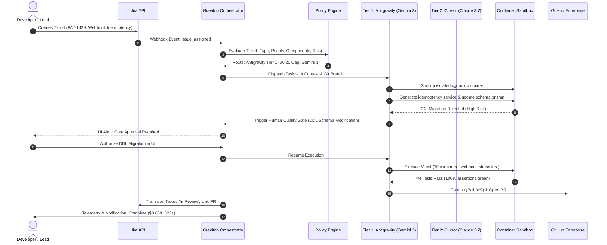
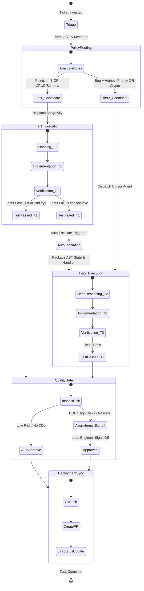

# Graviton: Autonomous Engineering Orchestrator & Jira Bridge

[](https://nodejs.org/)
[](https://github.com/muhammadhassan1244/Autonomous-Engineering-Orchestrator)
[-4285F4?logo=google&logoColor=white)](https://deepmind.google/)
[-7c3aed)](https://cursor.com/)
[](LICENSE)
[](#)

> **Graviton** is an enterprise-grade, policy-driven autonomous engineering orchestrator that sits between issue trackers (Jira, Linear, GitHub Issues) and AI coding agent runtimes. It automates ticket triage, dynamically routes tasks to the most cost-effective agent tier based on complexity, enforces human-in-the-loop safety gates, executes changes in isolated sandboxes, and synchronizes code commits and PRs back to Jira.

---

## Table of Contents

1. [Executive Summary & Value Proposition](#executive-summary--value-proposition)
2. [System Architecture](#system-architecture)
   - [High-Level Architecture Diagram](#high-level-architecture-diagram)
   - [Ticket Lifecycle Sequence Flow](#ticket-lifecycle-sequence-flow)
   - [Two-Tier Escalation State Machine](#two-tier-escalation-state-machine)
3. [Core Capabilities & Features](#core-capabilities--features)
4. [The 8-Stage Engineering Workbench](#the-8-stage-engineering-workbench)
5. [Policy Routing Engine & FinOps](#policy-routing-engine--finops)
6. [API Specification](#api-specification)
   - [REST Endpoints](#rest-endpoints)
   - [Server-Sent Events (SSE) Telemetry Stream](#server-sent-events-sse-telemetry-stream)
7. [Repository Structure](#repository-structure)
8. [Getting Started & Quickstart](#getting-started--quickstart)
9. [Automated Verification & Testing](#automated-verification--testing)
10. [Configuration & Guardrails](#configuration--guardrails)
11. [License](#license)

---

## Executive Summary & Value Proposition

Enterprise engineering organizations adopting generative AI face three major bottlenecks:
1. **Excessive Frontier Model Costs**: Routing every simple CRUD bug, documentation fix, or schema patch to expensive frontier models burns tens of thousands in unmanaged API spend.
2. **Lack of Governance & Quality Gates**: Autonomous agents modifying database schemas or running unconstrained migrations risk catastrophic production outages without human authorization.
3. **Tool Fragmentation**: Disconnect between Jira ticketing, agent execution environments, diff review tools, and GitHub pull request lifecycles.

**Graviton** solves these challenges by introducing:
- **Intelligent Fleet Allocation**: 68% of standard tasks are resolved by **Tier 1 (Google Antigravity with Gemini 3 Thinking / Flash)** at ~$0.04/task. Critical architectural or cryptographically sensitive tasks escalate to **Tier 2 (Cursor Agent with Claude 3.7 Sonnet Thinking)** at ~$0.58-$1.00/task, saving **up to 78% Month-to-Date (MTD)**.
- **Mandatory Quality & Risk Gates**: Automated risk scoring flags DDL schema modifications, relational table migrations (>1M rows), and crypto changes, locking execution until authorized by a Staff Engineer.
- **Bi-Directional Jira & Git Sync**: Real-time ticket status transitions (`In Progress` &rarr; `In Review` &rarr; `PR Created`), automated branch creation (`feat/PAY-1429-idempotency`), and atomic PR assembly.
- **Glassmorphic Multi-Device Workbench**: High-density desktop IDE layout with an off-canvas drawer and media queries responsive down to 320px mobile screens.

---

## System Architecture

### High-Level Architecture Diagram



---

### Ticket Lifecycle Sequence Flow



---

### Two-Tier Escalation State Machine



---

## Core Capabilities & Features

| Capability | Graviton Orchestrator | Traditional Agent Tools |
| :--- | :--- | :--- |
| **Routing Architecture** | Dynamic dual-tier multi-agent (Antigravity & Cursor) | Single runtime locked to one provider |
| **FinOps Cost Optimization** | Policy-driven model selection saving up to 78% MTD | Uncontrolled frontier token burn |
| **Safety Guardrails** | Automatic DDL approval gates & destructive command interception | Unchecked terminal execution |
| **Live Telemetry** | Real-time Server-Sent Events (SSE) tracking elapsed time & budget | Static polling or manual refresh |
| **Sandbox Isolation** | Cgroup/container sandbox with isolated ephemeral Postgres | Executes directly on developer host |
| **Verification & QA** | AST diff mutation checks, Vitest runner, and UI playback | Manual linting or basic unit tests |
| **Jira & Git Sync** | Bi-directional workflow sync with branch & PR automation | Manual branch and status updating |
| **User Interface** | Responsive dark-mode dashboard with mobile off-canvas drawer | CLI-only or standard web view |

---

## The 8-Stage Engineering Workbench

Graviton provides an 8-stage interactive engineering workflow tailored for Staff and Principal Engineers:

1. **Dashboard**
   - Fleet-wide telemetry, agent allocation balance (68% Antigravity / 32% Cursor), ticket queue, and Month-to-Date (MTD) FinOps savings counter.
2. **Jira & Policy Routing**
   - Deep dive into incoming tickets (`PAY-1429`, `AUTH-891`, `CORE-402`), policy rule triggers, target runtime assignments, and cost budget caps.
3. **AI Implementation Plan**
   - Architectural risk scorecard, file impact matrix (Modified `M`, Added `A`, Deleted `D`), DDL migration alerts, and human-in-the-loop authorization gates.
4. **Agent Execution Runtime**
   - Split-view workbench pairing a real-time agent **Thought Stream** (reasoning logs, tool calls) with a sandboxed **Virtual Terminal** displaying containerized bash execution.
   - Interactive human steer bar allowing real-time guidance prompts or paused execution.
5. **Code Changes & AST Diff**
   - Syntax-highlighted unified and split side-by-side diff viewers with line numbering, hunk headers, and contextual AI reasoning for every file modified.
6. **Testing & Verification**
   - Automated test runner executing unit and integration suites with concurrent stress simulations (e.g. 10 simultaneous webhook requests).
   - Headless browser recording simulator with time-scrubber and playback controls.
7. **Completion & Sync**
   - GitHub Pull Request creation summary, diff statistics (`+142 / -18`), commit hash reference, and automated bi-directional Jira ticket transition to `IN REVIEW`.
8. **Policy Engine & Providers Matrix**
   - Central control plane for configuring runtime endpoints, gRPC connections, fallback cascades, budget limits, and destructive operation guardrails.

---

## Policy Routing Engine & FinOps

Graviton uses an extensible rules matrix to evaluate every incoming issue against structured criteria before dispatching to an agent runtime:

```json
{
  "tier1": {
    "runtime": "antigravity",
    "endpoint": "grpc://antigravity.internal:8443",
    "model": "Gemini 3 (Thinking Core)",
    "workers": 4
  },
  "tier2": {
    "runtime": "cursor",
    "daemonUrl": "http://localhost:4040/cursor/v1",
    "model": "Claude 3.7 Sonnet (Thinking)",
    "autoEscalateFailures": 2
  },
  "rules": [
    {
      "id": 1,
      "condition": "Issue.Type == \"Bug\" AND Priority == \"Highest\"",
      "target": "Cursor Agent (Claude 3.7)",
      "budget": 1.50
    },
    {
      "id": 2,
      "condition": "Components in [\"DB\", \"Schema\", \"CRUD\", \"Fastify\"]",
      "target": "Antigravity (Gemini 3)",
      "budget": 0.20
    },
    {
      "id": 3,
      "condition": "StoryPoints <= 3 OR Labels in [\"chore\", \"docs\"]",
      "target": "Antigravity (Gemini 3 Flash)",
      "budget": 0.10
    },
    {
      "id": 4,
      "condition": "Fallback: If Tier 1 tests fail 2x",
      "target": "Auto-Escalate to Cursor",
      "budget": 0.80
    }
  ],
  "guardrails": {
    "mandatoryDbApproval": true,
    "blockDestructiveOps": true
  }
}
```

---

## API Specification

The Graviton backend runs a native Node.js HTTP server (`server.js`) without external framework dependencies.

### REST Endpoints

#### 1. List All Active Tickets
- **Endpoint**: `GET /api/tickets`
- **Response**: `200 OK`
```json
[
  {
    "key": "PAY-1429",
    "title": "Stripe webhook duplicate charge due to missing idempotency",
    "repo": "acme-corp/payment-service",
    "status": "executing",
    "assignedRuntime": "antigravity",
    "activeModel": "Gemini 3 (Thinking Core)",
    "step": 4,
    "totalSteps": 7,
    "cost": 0.038,
    "costCap": 0.50,
    "elapsedSeconds": 522,
    "branch": "feat/PAY-1429-idempotency",
    "riskLevel": "HIGH (DDL Migration)"
  }
]
```

#### 2. Get Ticket Details
- **Endpoint**: `GET /api/tickets/:id`
- **Parameters**: `id` (e.g. `PAY-1429`, `AUTH-891`, `CORE-402`)
- **Response**: `200 OK` (JSON Ticket Object) or `404 Not Found`

#### 3. Transition Ticket Status
- **Endpoint**: `POST /api/tickets/:id/transition`
- **Request Body**:
```json
{
  "status": "completed"
}
```
- **Response**: `200 OK`
```json
{
  "success": true,
  "ticket": { "key": "PAY-1429", "status": "completed" }
}
```

#### 4. Get Policy Engine Configuration
- **Endpoint**: `GET /api/policy-config`
- **Response**: `200 OK` (Returns active tier configs, rule matrix, and guardrails)

#### 5. Update Policy Engine Configuration
- **Endpoint**: `POST /api/policy-config`
- **Request Body**: JSON partial or full policy configuration
- **Response**: `200 OK` with updated configuration

---

### Server-Sent Events (SSE) Telemetry Stream

- **Endpoint**: `GET /api/stream/events`
- **Headers**:
  ```http
  Content-Type: text/event-stream
  Cache-Control: no-cache
  Connection: keep-alive
  ```
- **Event Payload (every 3 seconds)**:
  ```json
  data: {
    "type": "telemetry_tick",
    "timestamp": "2026-10-07T07:15:00.000Z",
    "ticket": {
      "key": "PAY-1429",
      "cost": 0.0385,
      "elapsedSeconds": 523
    }
  }
  ```

---

## Repository Structure

```
d:/google-antigravity/
├── index.html              # Graviton Desktop UI (8-stage workbench, modals, command palette)
├── app.js                  # Frontend Application Controller (state management, diffs, SSE)
├── style.css               # Design System (dark-mode theme, glassmorphism, responsive breakpoints)
├── server.js               # Node.js Backend Server (REST API, SSE telemetry, static hosting)
├── test-mobile-toggle.js   # Automated test suite (HTML structure, CSS queries, event listeners)
├── README.md               # Project documentation and architecture guide
└── .gitignore              # Git ignore configuration
```

---

## Getting Started & Quickstart

### Prerequisites

- [Node.js](https://nodejs.org/) v18.0.0 or higher
- Modern web browser (Chrome, Edge, Firefox, or Safari)

### Installation

1. Clone or open the repository workspace:
   ```bash
   git clone https://github.com/muhammadhassan1244/Autonomous-Engineering-Orchestrator.git
   cd Autonomous-Engineering-Orchestrator
   ```

2. Start the local Graviton Orchestrator server:
   ```bash
   node server.js
   ```

3. Launch the dashboard:
   Open your browser and navigate to:
   ```
   http://127.0.0.1:3000
   ```

### Command Palette & Keyboard Shortcuts

- Press <kbd>Ctrl</kbd> + <kbd>K</kbd> (or click the topbar search bar) to open the **Command Palette**.
- Rapidly switch between active tickets (`PAY-1429`, `AUTH-891`, `CORE-402`), trigger manual runtime escalations, or toggle split diff views.

---

## Automated Verification & Testing

Graviton includes an automated test runner verifying DOM elements, CSS media query rules, event binding, and state mutation:

```bash
node test-mobile-toggle.js
```

### Verification Checks:
- [x] `#mobile-menu-btn` hamburger structure and bar elements
- [x] `#sidebar-overlay` and `#sidebar-close-btn` drawer controls
- [x] Responsive CSS breakpoints at `1200px`, `1024px`, `768px`, and `480px`
- [x] Off-canvas drawer sliding transition (`.sidebar.mobile-open`)
- [x] Auto-dismiss drawer handler on navigation item selection
- [x] Multi-step simulated user interaction test

---

## Configuration & Guardrails

To protect production environments, Graviton enforces two critical guardrails configured in `server.js`:

1. **`mandatoryDbApproval: true`**:
   Any patch touching files matching `*schema.prisma`, `*migration*.sql`, or containing DDL statements will pause execution at Stage 3 (**AI Implementation Plan**) with a high-risk gate flag until explicitly authorized.
2. **`blockDestructiveOps: true`**:
   Sandboxed terminal commands containing `rm -rf /`, `DROP TABLE`, `TRUNCATE`, or `git push --force` are intercepted by the AST & sandbox security monitor and automatically rejected.

---

## License

This project is licensed under the MIT License. See the [LICENSE](LICENSE) file for details.
